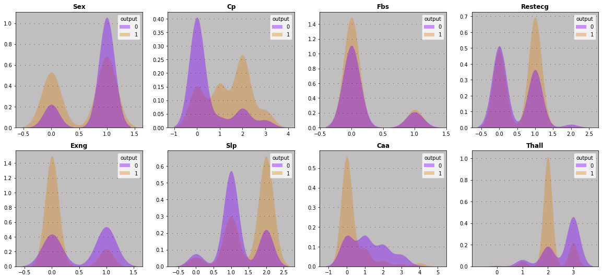

# Heart attacks prediction

Se realizó el análisis exploratorio de los datos, para daterterminar los principales motivos de un ataque al corazón.
Se creó un modelo utilizadon tensorflow y keras tuner con una precisión del 90%.

## Variables discretas

## Variables continuas

